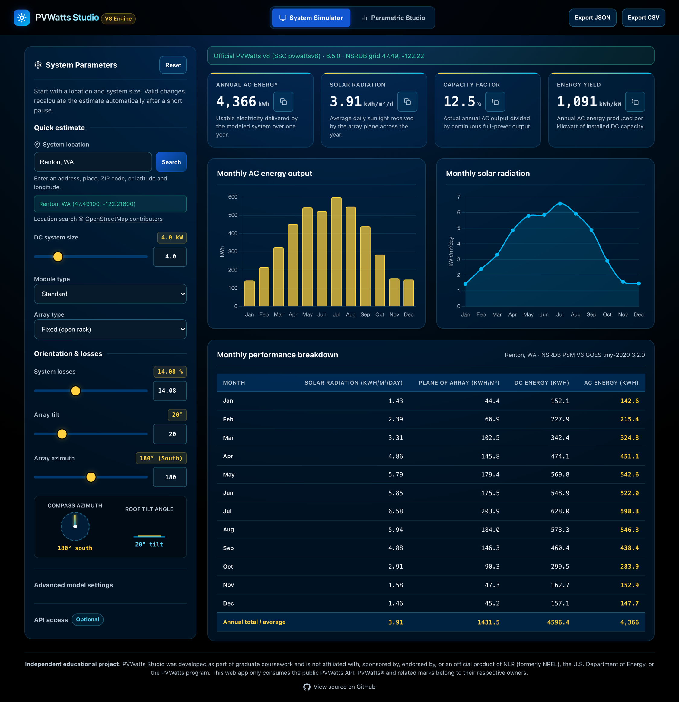

# PVWatts Studio

A small, dependency-free Python web interface for the official **PVWatts® v8 API**. It provides location search, monthly production charts, exports, advanced model inputs, and tilt/azimuth studies.

## Independent-project disclaimer

> **PVWatts Studio is an independent, third-party educational project developed as part of graduate coursework.** It is not affiliated with, sponsored by, endorsed by, or an official product of the National Laboratory of the Rockies (NLR, formerly NREL), the U.S. Department of Energy, or the PVWatts program. The web application only sends requests to and consumes responses from the publicly available PVWatts API; it does not include or redistribute the PVWatts service or its source code. No ownership of PVWatts, its underlying models or data, or any related names or marks is claimed. PVWatts® and related marks are the property of their respective owners. Use of the upstream API remains subject to its applicable terms and policies.



> **Which calculation path should I use?** The web application is the canonical path. It calls the current public PVWatts v8 service and NSRDB TMY data. The optional command-line engine uses bundled, preprocessed historical station data and is retained for offline comparisons.

## Quick start

Requirements:

- Python 3.10+
- Internet access for location search, Chart.js, and PVWatts calculations
- An [NLR developer API key](https://developer.nlr.gov/) (recommended)

No package installation is required; the application uses only the Python standard library.

```bash
NLR_API_KEY="your-key" python3 server.py
```

Open <http://localhost:8000>. You can also leave the environment variable unset and enter an API key in the browser.

The public `DEMO_KEY` is used when no key is supplied, but its low rate limit can produce HTTP 429 responses. The legacy `NREL_API_KEY` environment variable is also accepted.

### Server options

```bash
python3 server.py --port 8080
python3 server.py --host 0.0.0.0 --port 8000
```

The server binds to `127.0.0.1` by default so the browser-provided API key is not exposed to other devices. Only use a non-loopback host on a network you trust.

## Features

- Official PVWatts v8 calculations using current NSRDB TMY data
- Address, place, postal-code, and latitude/longitude search through OpenStreetMap Nominatim
- System size, module type, array type, losses, tilt, azimuth, DC/AC ratio, inverter efficiency, ground coverage ratio, albedo, bifaciality, and monthly irradiance-loss inputs
- Monthly and annual production, solar resource, capacity factor, and weather-grid metadata
- JSON and CSV exports
- A 77-combination tilt/azimuth parametric sweep
- Debounced updates, stale-request cancellation, and in-memory calculation caching

## How it works

```text
Location text
  -> OpenStreetMap/Nominatim geocoding
  -> latitude/longitude
  -> local Python server
  -> official PVWatts v8 API
  -> SSC pvwattsv8 + current NSRDB TMY
  -> normalized JSON response
  -> charts, table, and exports
```

The browser calls `POST /api/simulate` for normal calculations and `POST /api/simulate-batch` for parametric studies. The server validates inputs and requests `dataset=nsrdb`, `radius=0`, and `timeframe=monthly` from PVWatts.

A normal update costs one PVWatts request unless an identical calculation is cached. A full parametric sweep can cost up to 77 requests, so use a personal developer key for batch studies.

## API key handling

The browser key field is a password input. The application does not write its value to local storage, session storage, exports, or application files. It sends the key to the local server in the `X-NLR-API-Key` header, and the server uses it only for the corresponding PVWatts request.

Key precedence is:

1. Key entered in the browser
2. `NLR_API_KEY` on the server
3. Legacy `NREL_API_KEY` on the server
4. Public `DEMO_KEY`

The key remains visible in browser developer tools and is transmitted to NLR as required by the service.

## Optional historical CLI

The CLI runs the retained pure-Python approximation against preprocessed hourly station arrays. It does not call the public API and should not be used when results must match the current public PVWatts calculator.

```bash
python3 pvwatts_cli.py --location renton_tmy3 --size 4 --tilt 20 --azimuth 180
python3 pvwatts_cli.py --location seatac_tmy3 --size 6 --json
python3 pvwatts_cli.py --sweep-tilt --size 6 --losses 11 --azimuth 180
```

Available station IDs are listed in [`static/data/catalog.json`](static/data/catalog.json).

`--weather-file` remains for compatibility with older callers. Its filename is used to select a matching preprocessed station; the CLI does **not** parse arbitrary EPW contents. Commands that referenced the former bundled `weather_data/*.epw` paths continue to resolve to the equivalent preprocessed dataset.

## Development

Run the complete test suite:

```bash
python3 -m unittest discover -s tests -v
```

The tests use mocked PVWatts responses and local coordinate parsing, so they do not consume API quota.

Useful smoke tests:

```bash
python3 pvwatts_cli.py --location renton_tmy3 --json
python3 server.py --port 8080
```

When changing request or response fields, update the adapter tests, HTTP tests, and browser integration checks together.

## Repository layout

| Path | Purpose |
| --- | --- |
| [`server.py`](server.py) | Local HTTP server, static-file hosting, and JSON endpoints |
| [`pvwatts_api.py`](pvwatts_api.py) | Official v8 adapter, input validation, geocoder, and cache |
| [`static/index.html`](static/index.html) | Browser interface |
| [`static/app.js`](static/app.js) | API calls, charts, exports, and parametric sweep logic |
| [`static/styles.css`](static/styles.css) | Interface styling |
| [`tests/`](tests/) | Unit, HTTP, browser-markup, and legacy CLI regression tests |
| [`pvwatts_cli.py`](pvwatts_cli.py) | Optional historical-weather command-line interface |
| [`pvwatts_fast.py`](pvwatts_fast.py) | Optional pure-Python historical calculation engine |
| [`static/data/`](static/data/) | Preprocessed hourly arrays required by the historical engine |

### Data footprint policy

Only data required at runtime is tracked:

- `static/data/*.json` supports the optional historical CLI and engine.
- Raw EPW bundles are not required because the historical engine reads the preprocessed JSON arrays directly.
- Copies of SSC source are not required because the web application calls the hosted PVWatts API and does not compile SSC locally.

Keep downloaded weather bundles, generated export formats, and source-code reference copies outside the repository. The ignore rules cover the former local artifact paths to prevent accidental reintroduction.

## Location search and attribution

Location searches are submitted only when the user presses **Search** or **Enter**, rather than on every keystroke, to comply with the public Nominatim usage policy. Location data is © OpenStreetMap contributors.

PVWatts is a registered trademark of the National Laboratory of the Rockies (formerly NREL). See the [independent-project disclaimer](#independent-project-disclaimer) above.
